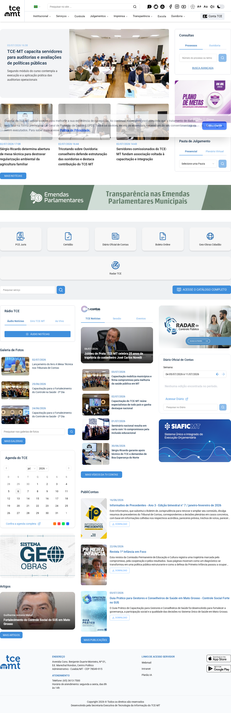
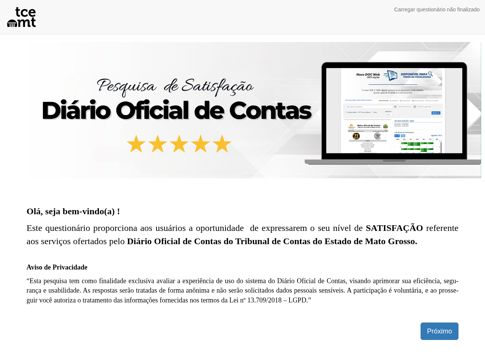
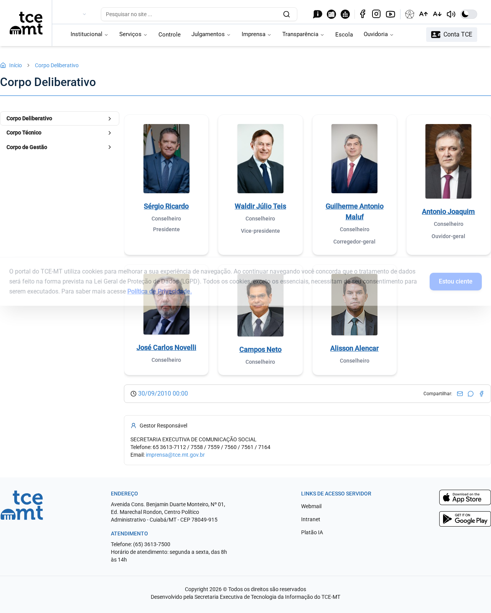
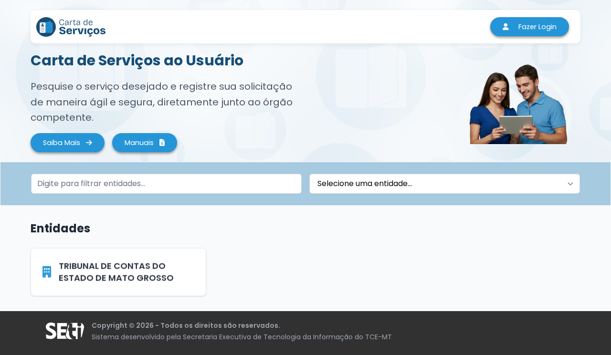
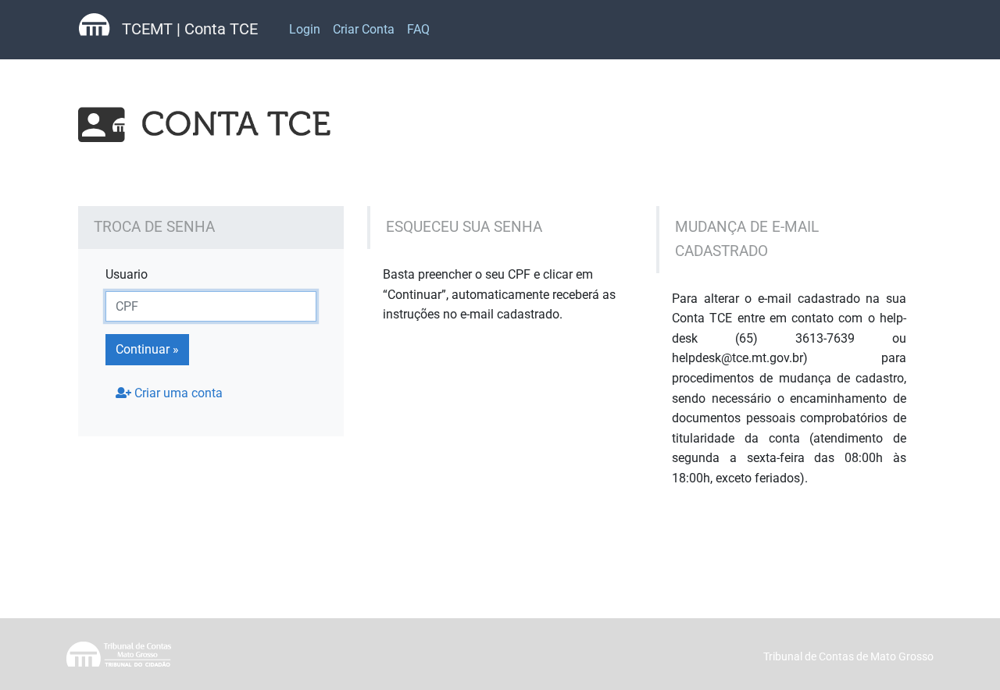
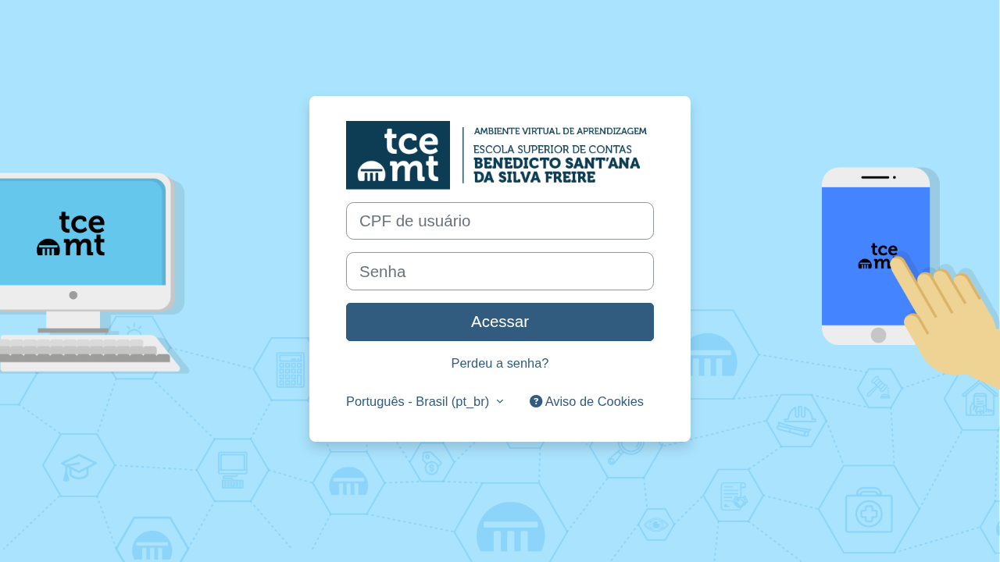
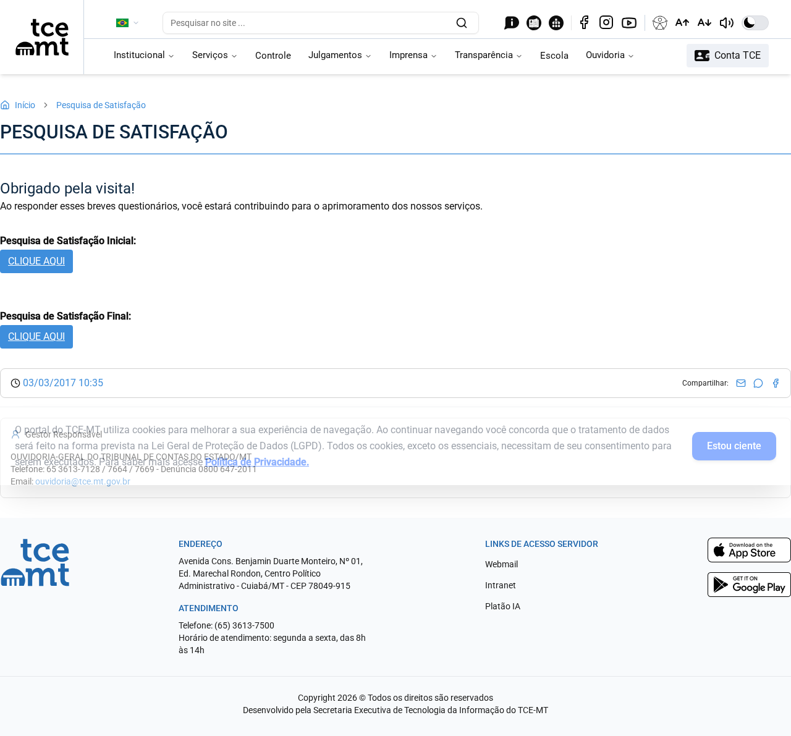
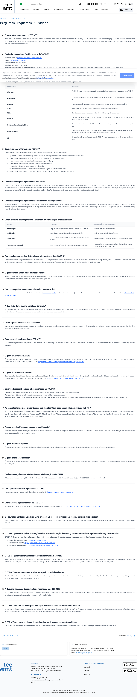

# RELATÓRIO DE ANÁLISE DE CONFORMIDADE LGPD

**Projeto de Extensão** — Análise de Conformidade com a LGPD no Portal do TCE-MT com Apoio de Inteligência Artificial

| Campo | Informação |
|-------|------------|
| **Aluno(a)** | _Renan Castro da Costa - RGA: 50001276_ |
| **Curso** | _Bacharel em Ciência e Tecnologia - UFMT_ |
| **Data** | 06/07/2026 |
| **Ferramenta(s) de IA utilizada(s)** | Cursor (agente de IA) + LGPD Auditor v0.1.0 (ferramenta desenvolvida com apoio de IA) |
| **Portal analisado** | https://www.tce.mt.gov.br/ |
| **Cobertura da auditoria** | 503 rotas visitadas · 503 evidências (screenshots) · 764 achados documentados |

---

## 1. Introdução

A Lei Geral de Proteção de Dados Pessoais (Lei nº 13.709/2018 — LGPD) estabelece regras sobre o tratamento de dados pessoais por pessoas naturais e jurídicas, com o objetivo de proteger os direitos fundamentais de liberdade, privacidade e o livre desenvolvimento da personalidade.

Este relatório apresenta a análise exploratória de conformidade do portal institucional do **Tribunal de Contas do Estado de Mato Grosso (TCE-MT)**, conduzida com apoio de ferramentas de Inteligência Artificial. O diagnóstico busca identificar elementos de coleta, tratamento e exposição de dados pessoais, avaliando transparência, consentimento, política de privacidade, segurança da informação e direitos do titular.

A metodologia priorizou **evidências verificáveis**: cada conclusão abaixo possui status de confiança (`Confirmado`, `Inferência` ou `Não Localizado`) e referência a prints (`evidence_id`) coletados automaticamente.

---

## 2. Metodologia

### 2.1 Como a análise foi realizada

1. **Navegação automatizada (crawler BFS)** com Playwright, respeitando `robots.txt`, em 503 páginas do ecossistema `tce.mt.gov.br` e subdomínios relacionados (Carta de Serviços, Conta TCE, EaD, LimeSurvey etc.).
2. **Captura de evidências**: screenshot full-page, resumo do conteúdo e metadados com hash SHA-256 por página.
3. **Classificação heurística LGPD** (regras 4.1 a 4.6) com apoio da ferramenta LGPD Auditor, desenvolvida com assistência de IA (Cursor).
4. **Revisão crítica** dos achados, organizando-os conforme o modelo acadêmico e a legislação vigente.

### 2.2 Critérios utilizados

- Transparência e política de privacidade (art. 9º LGPD)
- Coleta de dados e finalidade (arts. 7º e 9º LGPD)
- Consentimento (art. 8º LGPD)
- Direitos do titular e canais de contato (arts. 18 e 41 LGPD)
- Segurança da informação / HTTPS (art. 46 LGPD)
- Cookies e tecnologias de rastreamento (arts. 7º e 9º LGPD)

### 2.3 Governança anti-alucinação

Toda afirmação neste relatório está ancorada em evidência coletada do portal. Quando não há confirmação explícita, o status é classificado como **Inferência**, nunca como fato presumido.

---

## 3. Descrição do Ambiente Analisado

**Site principal:** https://www.tce.mt.gov.br/

**Áreas e subsistemas identificados na auditoria:**

| Área | Exemplo de URL | Evidência |
|------|----------------|-----------|
| Página inicial | https://www.tce.mt.gov.br/ | ev-001 |
| Institucional / Corpo Deliberativo | /corpo-deliberativo/15 | ev-002 |
| Carta de Serviços | https://cartadeservicos.tce.mt.gov.br/ | ev-003 |
| Conta TCE (login/cadastro) | https://conta.tce.mt.gov.br/ | ev-022 |
| Ouvidoria | /ouvidoria-perguntas-frequentes | ev-078 |
| Pesquisa de satisfação | /pesquisa-de-satisfacao/871 | ev-082 |
| Questionário com aviso LGPD | https://limesurvey.tce.mt.gov.br/ | ev-312 |
| Escola de Contas (EaD) | https://ead.tce.mt.gov.br/ava | ev-165 |

**Evidência — Página inicial do portal:**

*Figura 1 — Portal do TCE-MT (ev-001). URL: https://www.tce.mt.gov.br/*

---

## 4. Análise de Conformidade com a LGPD

### 4.1 Transparência e Política de Privacidade

**Perguntas do modelo:** Existe política de privacidade? Está acessível? Linguagem clara?

| Item | Resultado |
|------|-----------|
| **Status** | Confirmado |
| **Confiança** | Muito Alta (95%) |
| **Fundamentação** | Art. 9º LGPD |
| **Achados na auditoria** | 66 páginas com referências a privacidade/proteção de dados |

**Análise:**

Foi **confirmada** a existência de referências a política de privacidade e proteção de dados em diversas páginas do portal. Destaque para:

- Menu institucional com seção **"Produtos e Processos → LGPD"** presente em múltiplas páginas internas.
- Questionário de pesquisa (LimeSurvey) com **Aviso de Privacidade** explícito, informando finalidade, anonimato e base na Lei 13.709/2018 (ev-312).
- Páginas institucionais com links e termos relacionados a privacidade no rodapé e navegação.

**Ponto de atenção:** em parte das páginas, a referência aparece na estrutura de navegação (menu LGPD), mas a política completa nem sempre está em destaque na página analisada — classificação **Confirmado** com base em múltiplas evidências convergentes.

**Evidência — Aviso de Privacidade em questionário (texto identificado no conteúdo):**

*Figura 2 — Questionário com Aviso de Privacidade LGPD (ev-312). URL: https://limesurvey.tce.mt.gov.br/index.php/425193*

> _Trecho identificado no conteúdo:_ "Aviso de Privacidade — Esta pesquisa tem como finalidade exclusiva avaliar a experiência de uso do sistema [...] As respostas serão tratadas de forma anônima [...] ao prosseguir você autoriza o tratamento das informações fornecidas nos termos da Lei nº 13.709/2018 – LGPD."

**Evidência complementar — Seção LGPD no menu institucional:**

*Figura 3 — Página institucional com referências a LGPD (ev-002). URL: https://www.tce.mt.gov.br/corpo-deliberativo/15*

---

### 4.2 Coleta de Dados

**Perguntas do modelo:** Há formulários? Quais dados são solicitados? Há justificativa para coleta?

| Item | Resultado |
|------|-----------|
| **Status** | Inferência |
| **Confiança** | Alta (85%) |
| **Fundamentação** | Arts. 7º e 9º LGPD |
| **Achados na auditoria** | 123 páginas com indícios de coleta |

**Análise:**

Foram identificados **formulários e campos de coleta** em diversas áreas do ecossistema TCE-MT:

- **Conta TCE**: cadastro, login e recuperação de senha (campos de usuário e e-mail) — ev-022.
- **Carta de Serviços**: registro de solicitações de serviços — ev-003.
- **Pesquisa de satisfação**: coleta de opinião do usuário — ev-082.
- **Campos de busca** e formulários institucionais em páginas internas.

O status **Inferência** (e não Confirmado pleno) porque, em parte das páginas, os termos de coleta aparecem no conteúdo textual sem formulário HTML explícito capturado no resumo, ou a finalidade específica não está detalhada adjacente ao campo em todas as rotas.

**Evidência — Carta de Serviços (coleta de solicitações):**

*Figura 4 — Carta de Serviços ao Usuário (ev-003). URL: https://cartadeservicos.tce.mt.gov.br/*

**Evidência — Conta TCE (cadastro/recuperação de senha):**

*Figura 5 — Sistema Conta TCE — recuperação de senha (ev-022). URL: https://conta.tce.mt.gov.br/conta/recupera-senha*

---

### 4.3 Consentimento

**Perguntas do modelo:** O usuário consente explicitamente? Há checkbox ou aceite?

| Item | Resultado |
|------|-----------|
| **Status** | Confirmado |
| **Confiança** | Alta (85%) |
| **Fundamentação** | Art. 8º LGPD |
| **Achados na auditoria** | 62 páginas com mecanismos de consentimento |

**Análise:**

Foi **confirmado** o uso de mecanismos de consentimento em pelo menos dois contextos distintos:

1. **Questionário LimeSurvey (ev-312):** texto explícito de que, ao prosseguir, o usuário autoriza o tratamento nos termos da LGPD.
2. **Plataforma EaD (ev-165):** mensagem de que, ao continuar navegando, o usuário concorda com políticas do site (incluindo cookies/privacidade).

Em páginas institucionais genéricas, há referências a consentimento nos termos de navegação, porém sem checkbox individualizado visível em todas as rotas.

**Evidência — Consentimento no EaD:**

*Figura 6 — Escola de Contas EaD — aviso de concordância (ev-165). URL: https://ead.tce.mt.gov.br/ava*

> _Trecho identificado:_ "Se continuar navegando neste site, você assume concordar com nossas políticas."

**Evidência — Consentimento em pesquisa institucional:**

*Figura 7 — Pesquisa de Satisfação (ev-082). URL: https://www.tce.mt.gov.br/pesquisa-de-satisfacao/871*

---

### 4.4 Direitos do Titular

**Perguntas do modelo:** Há canal para solicitação de dados? Exclusão/alteração?

| Item | Resultado |
|------|-----------|
| **Status** | Confirmado |
| **Confiança** | Muito Alta (95%) |
| **Fundamentação** | Arts. 18 e 41 LGPD |
| **Achados na auditoria** | 12 páginas com canais identificados |

**Análise:**

Foi **confirmada** a existência de canais institucionais para o cidadão interagir com o TCE-MT:

- **Ouvidoria** — perguntas frequentes e tipos de manifestação (ev-078, ev-073).
- **Carta de Serviços** — registro formal de solicitações (ev-003).
- **Conta TCE** — gestão de credenciais do usuário (ev-022).

A seção **LGPD** no menu institucional indica área dedicada a proteção de dados, embora o encarregado (DPO) não tenha sido localizado com nome e e-mail explícitos em todas as páginas analisadas.

**Evidência — Ouvidoria (canal de manifestação do titular/cidadão):**

*Figura 8 — Ouvidoria — Perguntas Frequentes (ev-078). URL: https://www.tce.mt.gov.br/ouvidoria-perguntas-frequentes*

---

### 4.5 Segurança da Informação

**Perguntas do modelo:** Uso de HTTPS? Indícios de proteção?

| Item | Resultado |
|------|-----------|
| **Status** | Confirmado |
| **Confiança** | Alta (85%) |
| **Fundamentação** | Art. 46 LGPD · ISO 27001 |
| **Achados na auditoria** | 437 páginas servidas via HTTPS |

**Análise:**

**Todas as 503 rotas visitadas** foram acessadas via **HTTPS**, incluindo subdomínios (`conta.tce.mt.gov.br`, `cartadeservicos.tce.mt.gov.br`, `ead.tce.mt.gov.br`, `limesurvey.tce.mt.gov.br`). O portal institucional também referencia **Certificações ISO** no menu de Produtos e Processos, indicando compromisso organizacional com segurança da informação.

Não foi possível, nesta auditoria automatizada, validar configurações internas de servidor, criptografia em repouso ou políticas de acesso — esses pontos exigem análise técnica complementar.

**Evidência — Portal principal via HTTPS:**

*Figura 9 — Conexão segura no portal principal (ev-001)*

---

### 4.6 Uso de Cookies

**Perguntas do modelo:** Existe aviso de cookies? Permite gerenciar?

| Item | Resultado |
|------|-----------|
| **Status** | Confirmado |
| **Confiança** | Alta (85%) |
| **Fundamentação** | Arts. 7º e 9º LGPD |
| **Achados na auditoria** | 64 páginas com referências a cookies |

**Análise:**

Foi **confirmada** a presença de avisos relacionados a cookies e políticas de navegação, especialmente na plataforma **EaD (ev-165)**, com mensagem de concordância ao continuar navegando. Em parte das páginas do portal principal, a referência a cookies aparece como **Inferência** (termos no conteúdo sem banner granular de gerenciamento visível).

**Ponto de atenção:** não foi identificado, em todas as rotas, um banner de cookies com opções granulares (aceitar/recusar por categoria), padrão recomendado pela ANPD.

**Evidência — Aviso na plataforma EaD:**

*Figura 10 — Plataforma EaD com aviso de políticas/cookies (ev-165)*

---

## 5. Uso da Inteligência Artificial na Análise

### 5.1 Ferramentas utilizadas

| Ferramenta | Função na análise |
|------------|-------------------|
| **Cursor (IA)** | Desenvolvimento da ferramenta LGPD Auditor, revisão de achados e redação deste relatório |
| **LGPD Auditor v0.1.0** | Crawler, captura de screenshots, classificação heurística LGPD e geração de relatório |

### 5.2 Como a IA foi utilizada

A IA apoiou três etapas principais:

1. **Automação da navegação** — identificação de 503 rotas no ecossistema TCE-MT sem intervenção manual página a página.
2. **Classificação heurística** — análise de palavras-chave e padrões (formulários, consentimento, HTTPS, cookies) com status e nível de confiança.
3. **Síntese crítica** — organização dos 764 achados em categorias LGPD, sem inventar fatos ausentes das evidências.

### 5.3 Limitações reconhecidas

- A IA **não substitui** parecer jurídico ou auditoria humana especializada.
- Classificadores heurísticos podem gerar **falsos positivos** (ex.: menção a "LGPD" no menu ≠ política completa na página).
- Por isso, cada conclusão traz status `Confirmado` ou `Inferência` e print de evidência.

---

## 6. Resultados e Achados

### 6.1 Resumo executivo por seção

| Seção | Tema | Status | Confiança |
|-------|------|--------|-----------|
| 4.1 | Transparência e privacidade | Confirmado | Muito Alta (95%) |
| 4.2 | Coleta de dados | Inferência | Alta (85%) |
| 4.3 | Consentimento | Confirmado | Alta (85%) |
| 4.4 | Direitos do titular | Confirmado | Muito Alta (95%) |
| 4.5 | Segurança (HTTPS) | Confirmado | Alta (85%) |
| 4.6 | Cookies | Confirmado | Alta (85%) |

### 6.2 Pontos positivos

- Ecossistema digital amplo com **503 páginas mapeadas** e evidências documentadas.
- **HTTPS em 100%** das rotas visitadas.
- Seção institucional dedicada à **LGPD** no menu principal.
- **Aviso de Privacidade** explícito em questionários (LimeSurvey).
- Canais de **Ouvidoria** e **Carta de Serviços** para interação com o cidadão.
- Referências a **Certificações ISO** no portal.

### 6.3 Pontos de atenção (não conformidades parciais)

| # | Achado | Status | Risco |
|---|--------|--------|-------|
| 1 | Finalidade da coleta nem sempre explícita adjacente aos formulários | Inferência | Médio |
| 2 | Banner de cookies granular ausente em parte das páginas | Inferência | Médio |
| 3 | Identificação nominal do Encarregado (DPO) não localizada em todas as rotas | Não Localizado em parte | Baixo a Médio |
| 4 | Consentimento por "continuar navegando" pode não atender opt-in explícito em todos os casos | Confirmado/Inferência | Médio |

### 6.4 Riscos identificados

1. **Tratamento de dados em formulários** sem aviso de privacidade visível na mesma tela (Carta de Serviços, Conta TCE).
2. **Dependência de consentimento tácito** por navegação em subsistemas (EaD).
3. **Heterogeneidade** entre subdomínios — cada sistema (portal, conta, EaD, LimeSurvey) com padrão diferente de aviso LGPD.

---

## 7. Recomendações

1. **Publicar política de privacidade centralizada** com link fixo no rodapé de todas as páginas e subdomínios.
2. **Indicar o Encarregado de Dados (DPO)** com nome, e-mail e canal de contato visível na seção LGPD.
3. **Padronizar avisos de coleta** em todos os formulários (finalidade, base legal, tempo de retenção).
4. **Implementar banner de cookies** com opções de aceitar, recusar e personalizar, conforme orientações da ANPD.
5. **Substituir consentimento tácito** ("ao continuar navegando") por mecanismos de opt-in explícito onde houver tratamento não essencial.
6. **Estender práticas do LimeSurvey** (aviso de privacidade claro) para demais formulários do ecossistema.

---

## 8. Conclusão

A análise exploratória do portal do TCE-MT, conduzida com apoio de Inteligência Artificial e documentada em **503 evidências (screenshots)**, indica **aderência parcial à LGPD**, com pontos fortes em segurança (HTTPS), transparência institucional (seção LGPD) e canais de relacionamento com o cidadão (Ouvidoria, Carta de Serviços).

Os principais gaps concentram-se na **padronização** dos avisos de privacidade e consentimento entre subdomínios, e na **explicitação da finalidade** de coleta em formulários específicos. Recomenda-se que o TCE-MT utilize este diagnóstico como subsídio para plano de adequação contínua, com validação jurídica especializada.

**Diagnóstico geral:** Parcialmente Conforme — Confiança Alta (com base em 764 achados documentados).

---

## 9. Referências

- BRASIL. Lei nº 13.709, de 14 de agosto de 2018. Lei Geral de Proteção de Dados Pessoais (LGPD). Diário Oficial da União, Brasília, DF, 15 ago. 2018.
- ANPD — Autoridade Nacional de Proteção de Dados. Disponível em: https://www.gov.br/anpd
- ISO/IEC 27001:2022 — Sistemas de gestão da segurança da informação.
- ISO/IEC 27701:2019 — Extensão para gestão da privacidade da informação.
- Tribunal de Contas do Estado de Mato Grosso. Portal institucional: https://www.tce.mt.gov.br/
- Ferramenta LGPD Auditor v0.1.0 — repositório local: `lgpd-auditor/`
- Cursor — ambiente de desenvolvimento com agente de IA (https://cursor.com)

---

## 10. Anexos

### Anexo A — Índice de evidências citadas neste relatório

| Evidence ID | URL | Seção LGPD |
|-------------|-----|------------|
| ev-001 | https://www.tce.mt.gov.br/ | 4.2, 4.5 |
| ev-002 | https://www.tce.mt.gov.br/corpo-deliberativo/15 | 4.1 |
| ev-003 | https://cartadeservicos.tce.mt.gov.br/ | 4.2, 4.4 |
| ev-022 | https://conta.tce.mt.gov.br/conta/recupera-senha | 4.2, 4.4 |
| ev-078 | https://www.tce.mt.gov.br/ouvidoria-perguntas-frequentes | 4.4 |
| ev-082 | https://www.tce.mt.gov.br/pesquisa-de-satisfacao/871 | 4.3 |
| ev-165 | https://ead.tce.mt.gov.br/ava | 4.3, 4.6 |
| ev-312 | https://limesurvey.tce.mt.gov.br/index.php/425193 | 4.1, 4.3 |

### Anexo B — Lista completa de rotas visitadas

Arquivo CSV com 503 rotas: [`lgpd-auditor/audits/tce-mt/reports/visited_routes.csv`](lgpd-auditor/audits/tce-mt/reports/visited_routes.csv)

### Anexo C — Relatório técnico automatizado completo

- Markdown: [`lgpd-auditor/audits/tce-mt/reports/relatorio-lgpd-tce-mt.md`](lgpd-auditor/audits/tce-mt/reports/relatorio-lgpd-tce-mt.md)
- PDF: [`lgpd-auditor/audits/tce-mt/reports/relatorio-lgpd-tce-mt.pdf`](lgpd-auditor/audits/tce-mt/reports/relatorio-lgpd-tce-mt.pdf)
- Dashboard: [`lgpd-auditor/audits/tce-mt/reports/dashboard.html`](lgpd-auditor/audits/tce-mt/reports/dashboard.html)
- Validação: [`lgpd-auditor/audits/tce-mt/validation_report.json`](lgpd-auditor/audits/tce-mt/validation_report.json)

### Anexo D — Pasta de screenshots (503 evidências)

Diretório: `lgpd-auditor/audits/tce-mt/evidence/` (ev-001 a ev-503)

---

_Relatório elaborado em conformidade com o modelo acadêmico do Projeto de Extensão — TCE-MT / LGPD. Preencher nome e curso antes da entrega no AVA._
