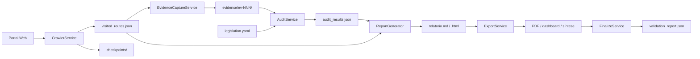

# Arquitetura

Este documento descreve a organização interna do **LGPD Auditor**, seus módulos e o fluxo de dados entre as etapas da auditoria.

## Princípios de design

- **Modularidade:** cada fase (crawler, evidências, auditoria, relatório) é um módulo independente com interface CLI própria
- **Rastreabilidade:** todo achado referencia `evidence_id`, hashes de conteúdo e fundamentação legal
- **Retomabilidade:** checkpoints permitem interromper e continuar o crawler sem perder progresso
- **Governança:** decisões técnicas registradas de forma append-only no Diário de Engenharia
- **Configuração externa:** portais e regras definidos em YAML, sem alteração de código

## Diagrama do pipeline



## Módulos

### `cli.py`

Ponto de entrada único. Parseia argumentos com `argparse` e delega para os serviços de cada fase. Todos os comandos recebem `--config` apontando para o YAML da auditoria.

### `config/`

Carrega e valida configurações com **Pydantic**:

- `AuditConfig` — identificação do portal (ID, nome, URL base, domínio)
- `CrawlerConfig` — workers, limites, rate limit, user-agent
- `PerformanceConfig` — limites de tempo e memória
- `PathsConfig` — caminhos relativos dos artefatos

### `crawler/`

| Componente | Responsabilidade |
|------------|------------------|
| `CrawlerService` | Orquestra BFS com pool de workers Playwright |
| `VisitedRoutesLog` | Persiste rotas visitadas em JSON |
| `RobotsChecker` | Respeita `robots.txt` quando habilitado |
| `url_utils` | Normalização de URL, filtro de domínio, extração de links |

O crawler salva resumos HTML em `checkpoints/html_resumo/` para análise posterior sem re-navegar.

### `checkpoint/`

`CheckpointManager` mantém o estado de cada URL (pendente, visitada, erro, bloqueada) permitindo retomada após interrupção.

### `evidence/`

| Componente | Responsabilidade |
|------------|------------------|
| `EvidenceCaptureService` | Captura screenshots e metadados via Playwright |
| `EvidenceStore` | Indexação e listagem de evidências (`index.json`) |
| `OcrService` | OCR opcional com Tesseract |

Cada evidência recebe ID sequencial (`ev-001`, `ev-002`, …) com hashes SHA-256 de conteúdo e screenshot.

### `audit/`

| Componente | Responsabilidade |
|------------|------------------|
| `LGPDRulesEngine` | Carrega regras de `legislation.yaml` |
| `HeuristicClassifier` | Busca keywords e padrões no texto das páginas |
| `AuditService` | Orquestra análise e persiste `audit_results.json` |

O classificador heurístico identifica indícios de conformidade ou não conformidade por seção (transparência, consentimento, direitos do titular, etc.) e atribui nível de confiança.

### `report/`

| Componente | Responsabilidade |
|------------|------------------|
| `ReportGenerator` | Renderiza templates Jinja2 em Markdown e HTML |
| `routes_export` | Exporta CSV de rotas visitadas |
| `DashboardGenerator` | Painel HTML interativo |
| `pdf_export` | Conversão HTML → PDF via WeasyPrint |

Templates ficam em `templates/report/`.

### `ai_synthesis/`

`EvidenceSynthesizer` gera a síntese executiva a partir dos resultados consolidados da auditoria.

### `validation/`

| Componente | Responsabilidade |
|------------|------------------|
| `RnfValidator` | Verifica requisitos não funcionais (workers, memória, tempo) |
| `MustChecklistValidator` | Valida checklist obrigatório da especificação |

### `governance/`

`EngineeringDiary` registra decisões técnicas em formato JSONL (append-only). Cada fase registra automaticamente problema, solução, justificativa e alternativas descartadas.

### `finalize_service.py`

Orquestra o pipeline completo da Fase 6 e consolida validações em `validation_report.json`.

## Fluxo de dados

```
config/tce-mt.yaml
       │
       ▼
  CrawlerService ──► visited_routes.json
       │                    │
       ▼                    ▼
  checkpoints/      EvidenceCaptureService
                           │
                           ▼
                    evidence/ev-NNN/
                           │
              legislation.yaml
                           │
                           ▼
                    AuditService ──► audit_results.json
                           │
                           ▼
                    ReportGenerator ──► reports/*.md, *.html, *.csv
                           │
                           ▼
                    ExportService ──► PDF, dashboard, síntese
                           │
                           ▼
                    RnfValidator + MustChecklistValidator
                           │
                           ▼
                    validation_report.json
```

## Artefatos persistentes

| Artefato | Formato | Mutável |
|----------|---------|---------|
| `visited_routes.json` | JSON | Append/update por rota |
| `checkpoints/` | JSON por URL | Update incremental |
| `evidence/index.json` | JSON | Append |
| `evidence/ev-NNN/metadata.json` | JSON | Imutável após captura |
| `audit_results.json` | JSON | Sobrescrito a cada `audit` |
| `engineering_diary.jsonl` | JSONL | Append-only |
| `validation_report.json` | JSON | Sobrescrito a cada `finalize` |
| `reports/*` | MD/HTML/CSV/PDF | Sobrescrito a cada geração |

## Fases de desenvolvimento

O projeto foi construído em 7 fases incrementais, cada uma com comando CLI e registro no Diário de Engenharia:

1. **Fase 0** — Estrutura, configuração, governança
2. **Fase 1** — Crawler BFS com checkpoints
3. **Fase 2** — Captura de evidências com hashes
4. **Fase 3** — Motor de regras LGPD heurísticas
5. **Fase 4** — Geração de relatórios Markdown/HTML
6. **Fase 5** — OCR, PDF, dashboard e síntese
7. **Fase 6** — Pipeline final e validação de RNFs

## Extensibilidade

Para auditar um novo portal:

1. Criar `config/novo-portal.yaml` (ver [Configuração](configuracao.md))
2. Ajustar `legislation.yaml` se necessário
3. Executar `init` com o novo config

Para adicionar regras de conformidade, edite `regras_conformidade` em `legislation.yaml` — o motor de regras carrega automaticamente na próxima execução de `audit`.
